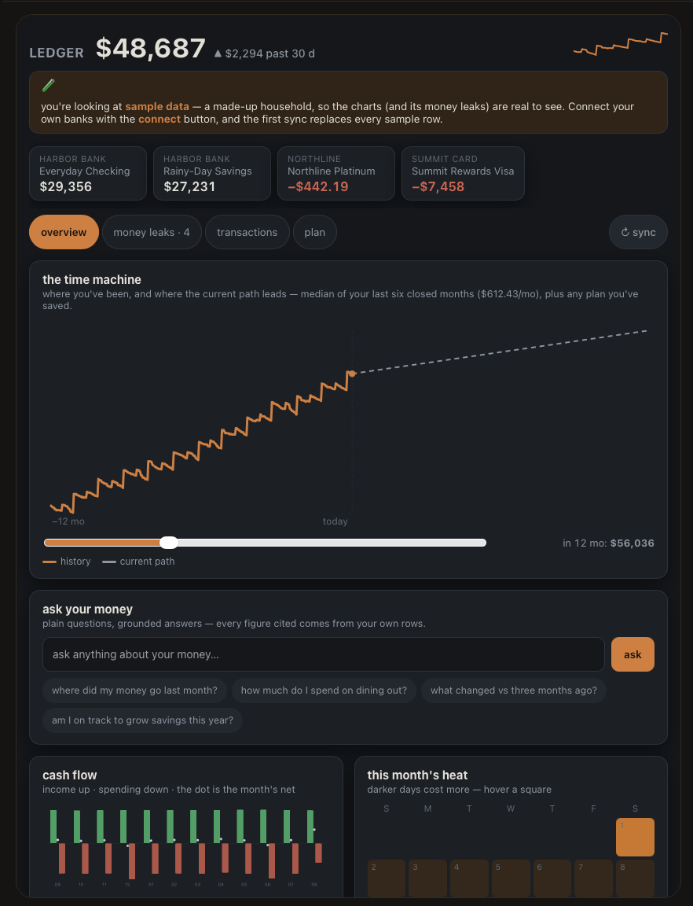
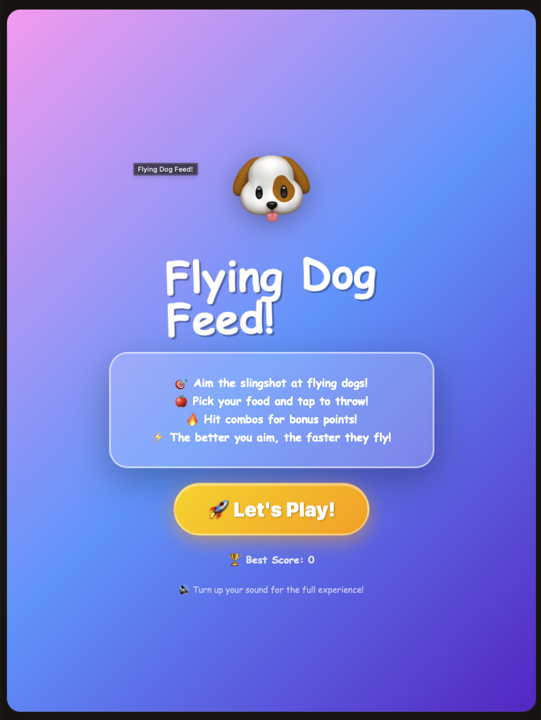
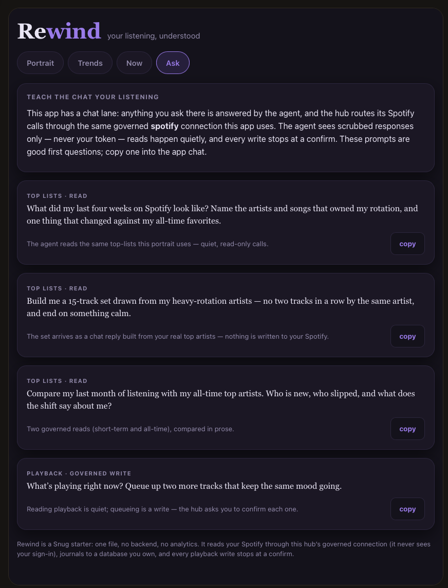

<p align="center">
  
</p>

<h1 align="center">Snug — the Snug Protocol</h1>

<p align="center"><strong>An open protocol for portable, agent-backed personal software.</strong></p>

<p align="center">
  Describe a small app in chat and the agent writes it. It runs in a hard sandbox and
  <em>thinks through the host's agent at runtime</em>,<br />
  while the app and its accumulated state — code, data, versions, chats — live in
  <strong>one portable <code>.snug</code> file the user keeps</strong>.
</p>

<p align="center">
  <a href="LICENSE"></a>
  <a href="https://github.com/snugprotocol/spec"></a>
  <a href="docs/threat-model.md"></a>
  <a href="https://snugprotocol.org/download/"></a>
</p>

<p align="center">
  <a href="https://snugprotocol.org">Website</a> ·
  <a href="https://playground.snugprotocol.org">Playground</a> ·
  <a href="https://snugprotocol.org/docs/">Docs</a> ·
  <a href="https://snugprotocol.org/docs/spec/">Spec</a> ·
  <a href="https://snugprotocol.org/download/">Download for macOS</a>
</p>

---

## Why Snug is different

A Snug app is **not** what a code generator produces. Three things set it apart:

1. **The app's brain is the host agent.** A Snug chess game doesn't embed a chess engine — it sends the board to the host LLM through a standard `postMessage` envelope and animates the reply. The app is a *body*; the agent is the *mind*. Each app carries a compact **runtime contract** authored at build time, so the same app runs well on any brain — including small local models.

2. **You own your apps and your data.** Everything — every app's code, ≥5 versions, its isolated database, your chats, your settings — lives in **one portable `.snug` file** (real SQLite, openable with ordinary tools, optionally passphrase-sealed). Download it, back it up, move it. Not vendor cloud rows: a file.

3. **It's embeddable.** Any product can drop in the runner + SDK and let *their* users build micro apps powered by *their* existing AI assistant. Snug is a protocol + reference implementation — the hosted Playground is the demo, not the product.

### What people build

| Money that answers questions | A game the agent plays with you | Your services, connected safely |
|:---:|:---:|:---:|
|  |  |  |
| "what did I spend on dining out?" works even though the app never shipped that screen — the chat beside every app can query its data directly. | Built by describing it. The original flying-pig version was built by an 11-year-old talking to the AI. | Apps reach your services **only through the host**, inside a human-approved ceiling. Tokens never enter the iframe, never reach the LLM. |

## Try it in 10 minutes — no API key needed

```bash
git clone https://github.com/snugprotocol/snug.git && cd snug
pnpm install                # ~2 min
pnpm dev                    # server (mock "demo brain" — no key) + Playground, one command
# open the printed URL → click a suggestion chip → build → run
```

Verify the whole stack if you like:

```bash
pnpm build && pnpm test     # everything green (under 3 min)
pnpm smoke                  # headless happy path: build an app via the mock adapter
```

**Bring your own key:** open **settings** in the Playground, pick BYOK, paste an Anthropic or OpenAI key. It's stored in `snug_secrets` inside your own local user-DB file — stripped from hub sync and default exports, sent only to the provider. The starter apps run with zero setup.

**Prefer an app?** [Download Snug for macOS](https://snugprotocol.org/download/) — native fetch, loopback OAuth, and your file at `~/Snug/user.snug` on disk.

## Embed it in your product

Snug exists so any web app can offer this to its users: drop in `@snugprotocol/runner` + `@snugprotocol/sdk`, point them at your existing assistant through an adapter, and your users build micro apps that think through *your* agent — while their data stays in *their* file.

Start here: [implementor's guide](https://snugprotocol.org/docs/get-started/implementors/) · [embedding docs](https://snugprotocol.org/docs/build/embed/) · [the spec](https://snugprotocol.org/docs/spec/).

## Security is architectural, not policy

- Apps run in a locked-down iframe sandbox (`allow-scripts` only) with **no network of their own** — `connect-src` blocked, fixed CDN allowlist.
- Credentials live in `snug_secrets` inside your own file — **never in the iframe, never sent to the hub, never shown to the LLM**. Connected apps reach your services only through the host executor, inside a frozen, human-approved host ceiling.
- **No telemetry.**
- The written [threat model](docs/threat-model.md) states what is enforced, where, and which test would catch a regression — and, with equal prominence, what is **accepted and not mitigated**.

> **Desktop is macOS-only through 1.0, for a security reason** — on Windows, WebView2 injects the shell's IPC key into app iframes and no off-switch exists (threat model R-5). The browser Playground runs everywhere. Reporting: [SECURITY.md](SECURITY.md).

## What's in this repo

This is the **reference implementation monorepo**. The protocol specification lives in [`snugprotocol/spec`](https://github.com/snugprotocol/spec) — **Specification 1.0 is normative** (one section, standing approvals, is explicitly provisional). Implementation packages remain pre-1.0 and may still move. Status: [docs/next-steps.md](docs/next-steps.md).

| Path | What it is |
|---|---|
| `packages/protocol` | `@snugprotocol/protocol` — typed envelope bindings; **source of truth for spec schemas** |
| `packages/runner` | `@snugprotocol/runner` — sandboxed iframe runner + bridge host |
| `packages/sdk` | `@snugprotocol/sdk` — in-app hooks: `useSnugApp`, `usePersistedState`, `useAppDB` (embedded + module forms) |
| `packages/db` | `@snugprotocol/db` — sql.js + OPFS per-app isolated database, `.snug` export/import, optional passphrase encryption at rest |
| `packages/auth` | `@snugprotocol/auth` — Dynamic Auth core + the connected-fetch executor: local-first credential handling, the frozen per-connection host ceiling, injection and response scrubbing |
| `packages/knowledge` | `@snugprotocol/knowledge` — the LLM app-authoring knowledge base |
| `packages/adapters` | `@snugprotocol/adapters` — anthropic, openai, mock |
| `apps/playground` | Snug Playground — hosted demo (chat → build → run) |
| `apps/desktop` | The macOS desktop shell (Tauri 2) — native fetch, loopback OAuth, `~/Snug/user.snug` on disk |
| `apps/server` | Minimal reference backend (`/invoke` + artifact store) — **optional**; the hub is static and needs no backend |
| `apps/whatsapp-sidecar` | Local linked-device helper for the Telepath starter (desktop-only, LLM-free by construction) |
| `apps/website` | [snugprotocol.org](https://snugprotocol.org) — marketing, docs & spec hub, desktop download (static Astro + Starlight) |
| `examples/` | Curated starter apps — each doubles as docs example and test fixture |

## Contributing

This repo runs an agentic engineering process — **start at [docs/INDEX.md](docs/INDEX.md)**. No work outside a task file; every session closes with `/close-session`.

Contributions are welcome: [CONTRIBUTING.md](CONTRIBUTING.md) explains how outside PRs fit the process, and [docs/good-first-issues.md](docs/good-first-issues.md) lists curated entry points (mirrored on the `good first issue` label).

## License

[MIT](LICENSE) · Security contact: security@snugprotocol.org ([SECURITY.md](SECURITY.md))

---

<p align="center">Built by <a href="https://github.com/jeetumaker">Jeetu Maker</a></p>
